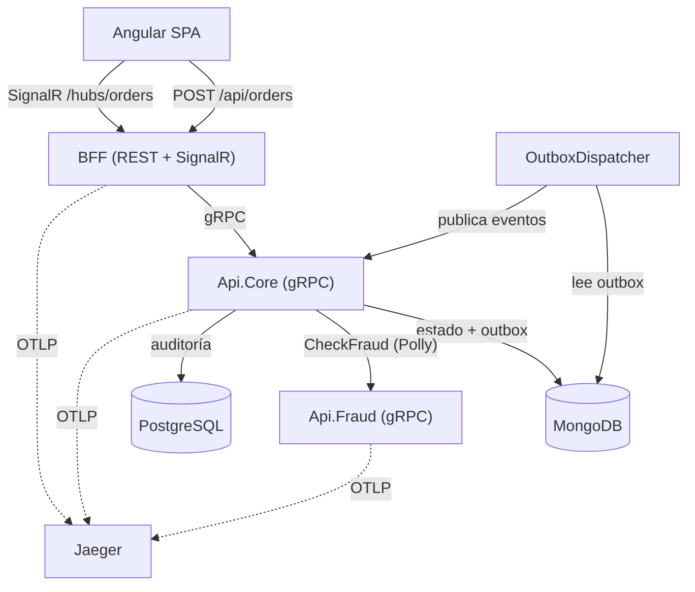
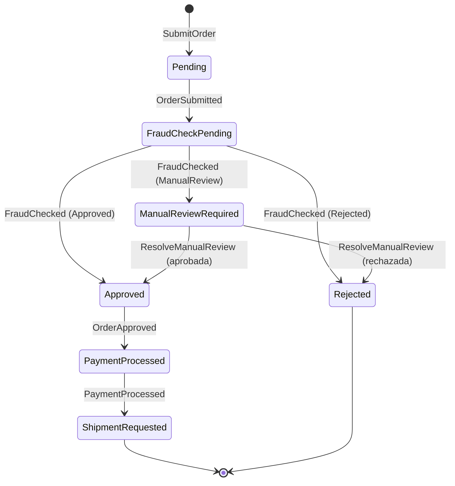

# 🚀 Challenge: Real-Time Order Orchestration Platform

## Scenario
You are building a **Fraud Detection & Order Orchestration System** for a high-volume e-commerce platform.  
Orders come in via gRPC, need real-time fraud checks, event-based orchestration, and eventual consistency across NoSQL (read/event store) and SQL (reporting/audit).

## Core Requirements

### 1. **gRPC Service (.NET)**
- Expose `SubmitOrder` (unary) and `TrackOrderStatus` (server streaming).
- Order contains: `OrderId`, `UserId`, `Items[]`, `TotalAmount`, `PaymentToken`.

### 2. **Mediator Pattern (MediatR)**
- Use MediatR to handle the `SubmitOrderCommand`.
- The handler should publish an `OrderSubmittedEvent`.

### 3. **Eventing & Orchestration**
- Events: `OrderSubmitted`, `FraudChecked`, `OrderApproved`, `OrderRejected`, `PaymentProcessed`, `ShipmentRequested`.
- Implement a **state machine orchestrator** (not a workflow engine, but your own lightweight orchestration logic) that listens to events and decides next steps.

### 4. **Storage**
- **NoSQL (MongoDB / Cosmos DB)** → Store order state (aggregate root) and events as a single document per order.
- **SQL (PostgreSQL / SQL Server)** → Store audit logs and reporting data (fraud check results, timestamps, user history).

### 5. **Fraud Check Simulation (gRPC client)**
- Call an external mock fraud service (gRPC) that randomly approves/rejects or takes 2 seconds to respond.
- Handle timeouts and retries.

### 6. **Containerization (Docker)**
- Dockerfile for .NET API + Angular UI.
- `docker-compose` to run: API, Angular (nginx), MongoDB, PostgreSQL, mock fraud service.

### 7. **Kubernetes Readiness**
- Provide K8s manifests (Deployment, Service, ConfigMap, Secret) for the API.
- Include liveness/readiness probes, resource limits, and an init container for DB migrations.

---

## 🧩 Bonus (Principal-Level Expectations)

- **Idempotency** – gRPC requests may be retried; ensure no duplicate processing.
- **Outbox pattern** – Events must be reliable (store in NoSQL + publish to message broker). You can simulate an in-memory broker but describe how you'd use RabbitMQ / Kafka.
- **Resilience** – Use Polly for retries, circuit breaker for fraud service.
- **Observability** – Add structured logging with OpenTelemetry + Jaeger traces for the full flow.
- **gRPC reflection & health checks**.
- **Angular UI** – Minimal dashboard showing real-time order status updates (via gRPC server streaming or SignalR if you prefer, but justify).

---

## 📦 Deliverables Expected from Candidate

| Artifact | Purpose |
|----------|---------|
| `README.md` | Architecture decisions, trade-offs, how to run everything |
| `docker-compose.yml` & Dockerfiles | Run full stack locally |
| K8s YAMLs | Deploy to minikube / kind |
| .NET solution | Clean Architecture (Commands, Events, Handlers, Orchestrator, Repos) |
| Angular app | One simple page consuming gRPC (or gRPC-web) |
| `orchestrator.cs` | Core orchestration logic (state machine) |
| Unit + integration tests | At least for the fraud check flow |

---

## 🧠 Evaluation Criteria (Principal Level)

| Area | What We Assess |
|------|----------------|
| **Architecture** | Separation of concerns, use of MediatR, event-driven vs request-driven choices |
| **Data consistency** | How you handle eventual consistency between NoSQL and SQL |
| **Orchestration** | Is the orchestrator stateless? How are sagas compensated? |
| **Resilience** | Retries, idempotency, outbox, timeout handling |
| **DevOps** | Docker best practices, K8s readiness probes, init containers |
| **Communication** | README clarity, trade-offs documented |

---

## 🧪 Example Flow (Expected Behavior)

1. Client calls `SubmitOrder` (gRPC).
2. API saves order as `Pending` in NoSQL, publishes `OrderSubmitted` event.
3. Orchestrator consumes event → calls Fraud Service (gRPC).
4. Fraud responds → `FraudChecked` event.
5. Orchestrator decides:
   - If approved → `OrderApproved` → simulate payment → `ShipmentRequested`.
   - If rejected → `OrderRejected` → stop.
6. All state changes append to NoSQL event log.
7. SQL audit table records each step with timestamp.
8. Client can stream `TrackOrderStatus` to see real-time updates.

---

## 🔁 Twist (Optional for harder mode)

> The fraud service sometimes sends a `ManualReviewRequired` response. Implement a **human-in-the-loop** via a simple Angular admin panel to approve/reject stalled orders, and continue orchestration.

---
---

# 📐 Implementación

Esta sección documenta **la solución implementada** para el reto anterior: arquitectura, decisiones de diseño, trade-offs y cómo ejecutar todo.

## Tabla de contenidos
- [Arquitectura](#arquitectura)
- [Flujo de una orden](#flujo-de-una-orden)
- [Máquina de estados](#máquina-de-estados)
- [Decisiones de diseño y trade-offs](#decisiones-de-diseño-y-trade-offs)
- [Cómo ejecutar](#cómo-ejecutar)
  - [Docker Compose (recomendado)](#docker-compose-recomendado)
  - [Local (sin contenedores)](#local-sin-contenedores)
  - [Kubernetes](#kubernetes)
- [Pruebas](#pruebas)
- [Observabilidad](#observabilidad)
- [Issues conocidos](#issues-conocidos)

## Arquitectura

Solución .NET 10 con **Clean Architecture**:

| Proyecto | Responsabilidad |
|----------|-----------------|
| `OrderOrchestration.Domain` | Entidades (`Order`, `OrderItem`, `OrderStatus`, `AuditLog`, `OutboxMessage`), eventos de dominio y contratos de repositorio. Sin dependencias de infraestructura. |
| `OrderOrchestration.Application` | Casos de uso: `SubmitOrderCommand`, `ResolveManualReviewCommand`, el `Orchestrator` (máquina de estados, MediatR) y el `AuditEventHandler`. |
| `OrderOrchestration.Infrastructure` | MongoDB (estado + outbox), PostgreSQL/EF Core (auditoría), cliente gRPC de fraude con Polly, `OutboxDispatcher` (worker) y `InMemoryOrderStatusNotifier`. |
| `OrderOrchestration.Api.Core` | Servidor gRPC (`OrderService`): `SubmitOrder`, `TrackOrderStatus`, `ResolveManualReview`, `GetPendingReviews`. Health checks + reflection. |
| `OrderOrchestration.Api.Fraud` | Servicio gRPC mock de fraude (aprueba/rechaza/revisión manual; simula latencia). |
| `OrderOrchestration.Api.Bff` | Gateway REST + SignalR para el frontend. |
| `OrderOrchestration.Tests` | Pruebas unitarias (xUnit + Moq). |
| `frontend/` | SPA Angular (envío de órdenes, seguimiento en vivo y panel de revisión manual). |



## Flujo de una orden

1. El cliente envía la orden (REST -> BFF -> gRPC `SubmitOrder`).
2. `Api.Core` guarda la orden como `Pending` en MongoDB junto con el evento `OrderSubmitted` en el **outbox** (atómico).
3. El `OutboxDispatcher` (worker) lee los eventos no procesados y los publica vía MediatR `IPublisher` (broker in-process), marcándolos como procesados de forma atómica.
4. El `Orchestrator` consume `OrderSubmitted`, llama al servicio de fraude (gRPC, con resiliencia Polly) y emite `FraudChecked`.
5. Según la decisión: `Approved` -> pago -> `ShipmentRequested`; `Rejected` -> fin; `ManualReview` -> `ManualReviewRequired` (espera resolución humana).
6. El `AuditEventHandler` registra cada paso en PostgreSQL (con el `PaymentToken` enmascarado).
7. El cliente ve el avance en tiempo real vía `TrackOrderStatus` (gRPC stream) reenviado por SignalR.

## Máquina de estados



## Decisiones de diseño y trade-offs

- **Orquestador como máquina de estados (no motor de workflow).** Lógica propia y ligera mediante handlers de MediatR. Cada handler valida el estado actual antes de transicionar, lo que lo hace **idempotente** ante reentregas.
- **Patrón Outbox para fiabilidad de eventos.** El estado y el evento se persisten juntos en el documento de la orden (Mongo). El `OutboxDispatcher` publica y marca como procesado con una **actualización posicional atómica** (`OutboxMessages.$`), evitando perder cambios de estado concurrentes del orquestador. Entrega *at-least-once* + handlers idempotentes.
  - *Broker*: hoy es el `IPublisher` in-process de MediatR. Para producción se sustituiría por **RabbitMQ/Kafka** publicando desde el mismo bucle de lectura del outbox (la lógica de lectura/marcado no cambia); el `Type`/`Content` del `OutboxMessage` ya está serializado para viajar por el bus.
- **Consistencia eventual NoSQL + SQL.** Mongo es la fuente de verdad del estado y los eventos (modelo agregado, una orden = un documento). Postgres almacena la auditoría/reportería derivada. La auditoría se escribe al consumir cada evento, por lo que es **eventualmente consistente** con el estado.
- **Idempotencia.** `SubmitOrder` deduplica por `PaymentToken` (verificación + índice único en Mongo como red de seguridad). Las reentregas del outbox no producen efectos dobles porque los handlers validan el estado.
- **Resiliencia (Polly).** El cliente de fraude usa retry exponencial + circuit breaker + timeout por intento (1s). Maneja tanto `RpcException` como `TimeoutRejectedException` (el mock tarda 2s el 30% de las veces para ejercitar el flujo).
- **Tiempo real: SignalR vs gRPC-web.** Se eligió **SignalR** en el BFF en lugar de gRPC-web directo porque: (a) ya hay un BFF como punto único para el navegador (evita exponer gRPC y un proxy Envoy para gRPC-web); (b) reconexión automática y manejo de transporte (WebSocket/SSE/long-polling) listos; (c) el BFF puede agregar/transformar datos para la UI. El BFF consume el stream gRPC `TrackOrderStatus` y lo reenvía por SignalR.
- **Human-in-the-loop (twist).** El fraude puede pedir `ManualReview`; la orden se detiene en `ManualReviewRequired` y un operador la resuelve desde el panel admin (REST `POST /api/orders/{id}/review` -> gRPC `ResolveManualReview`), continuando la orquestación.
- **Seguridad (app financiera).** Validación de entrada en BFF y Core; el `PaymentToken` nunca se registra en logs ni en auditoría (se enmascara a los últimos 4); errores genéricos hacia el exterior.

## Cómo ejecutar

### Docker Compose (recomendado)

Levanta todo el stack (Mongo, Postgres, Jaeger, fraude, core, BFF y frontend):

```bash
docker compose up --build
```

- Frontend: http://localhost:8088
- Jaeger UI: http://localhost:16686
- BFF (REST): el frontend lo consume vía nginx (`/api`, `/hubs`).

### Local (sin contenedores)

Requisitos: .NET 10 SDK + runtime, MongoDB en `localhost:27017`, PostgreSQL en `localhost:5432` (db `AuditDb`, user `postgres`/`pgadmin`), Node.js 20 para el frontend.

```bash
# Terminales separadas
dotnet run --project OrderOrchestration/OrderOrchestration.Api.Fraud   # :5104
dotnet run --project OrderOrchestration/OrderOrchestration.Api.Core    # :5136
dotnet run --project OrderOrchestration/OrderOrchestration.Api.Bff     # :5193

# Frontend
cd frontend
npm install
npm start   # http://localhost:4200
```

### Kubernetes

Construye las imágenes y aplícalas en minikube/kind:

```bash
# Construir imágenes (ejemplo con el daemon de minikube)
eval $(minikube docker-env)
docker build -t oo-fraud:latest    -f OrderOrchestration/OrderOrchestration.Api.Fraud/Dockerfile OrderOrchestration
docker build -t oo-core:latest     -f OrderOrchestration/OrderOrchestration.Api.Core/Dockerfile  OrderOrchestration
docker build -t oo-bff:latest      -f OrderOrchestration/OrderOrchestration.Api.Bff/Dockerfile   OrderOrchestration
docker build -t oo-frontend:latest -f frontend/Dockerfile frontend

# Desplegar
kubectl apply -k k8s/

# Acceso al frontend (NodePort)
minikube service frontend -n order-orchestration
```

Los manifiestos incluyen `ConfigMap`, `Secret`, probes (gRPC para Core/Fraud, TCP/HTTP para BFF/Frontend), límites de recursos y un init container que espera a Postgres/Mongo antes de arrancar el Core (las migraciones de EF se aplican al iniciar).

## Pruebas

```bash
dotnet test OrderOrchestration/OrderOrchestration.Tests/OrderOrchestration.Tests.csproj
```

Cubre las transiciones del orquestador (incluida la revisión manual), idempotencia del envío de órdenes, el handler de resolución manual, el pipeline de resiliencia (retry/timeout), el worker de outbox y el notificador de estado.

## Observabilidad

Trazas distribuidas con **OpenTelemetry** exportadas por OTLP a **Jaeger**. Instrumentación de ASP.NET Core y HttpClient (cubre las llamadas gRPC entrantes/salientes) más spans propios en el `Orchestrator` y el `OutboxDispatcher`. El endpoint se configura con `OTEL_EXPORTER_OTLP_ENDPOINT`.

## Issues conocidos

- **Runtime .NET 10.** Las apps ASP.NET requieren que el parche de `Microsoft.NETCore.App` coincida con el targeting pack; usar SDK + runtime consistentes. En contenedores no aplica (imágenes oficiales).
- **gRPC en texto plano (h2c).** En local/contenedores el tráfico gRPC va sobre HTTP/2 sin TLS por simplicidad. En producción debe ir cifrado (TLS/mTLS), idealmente gestionado por un service mesh o ingress, configurable por variable de entorno sin cambios de código.
